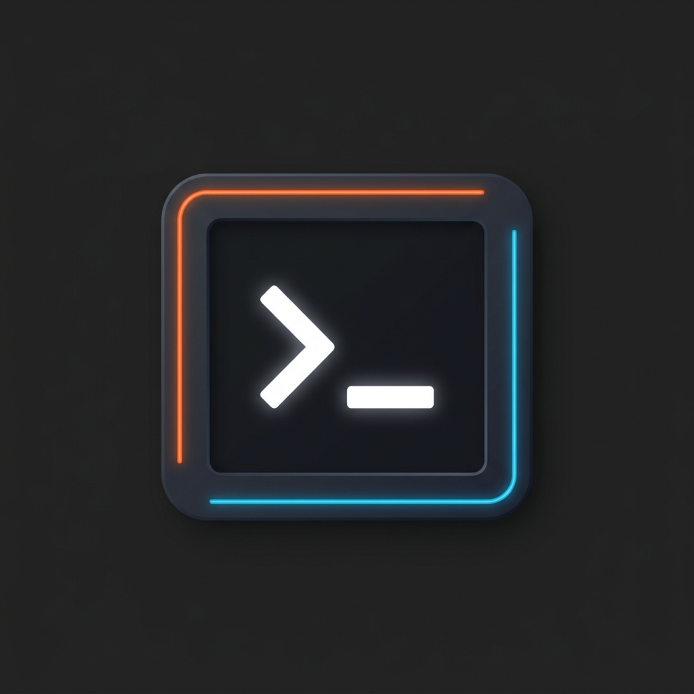
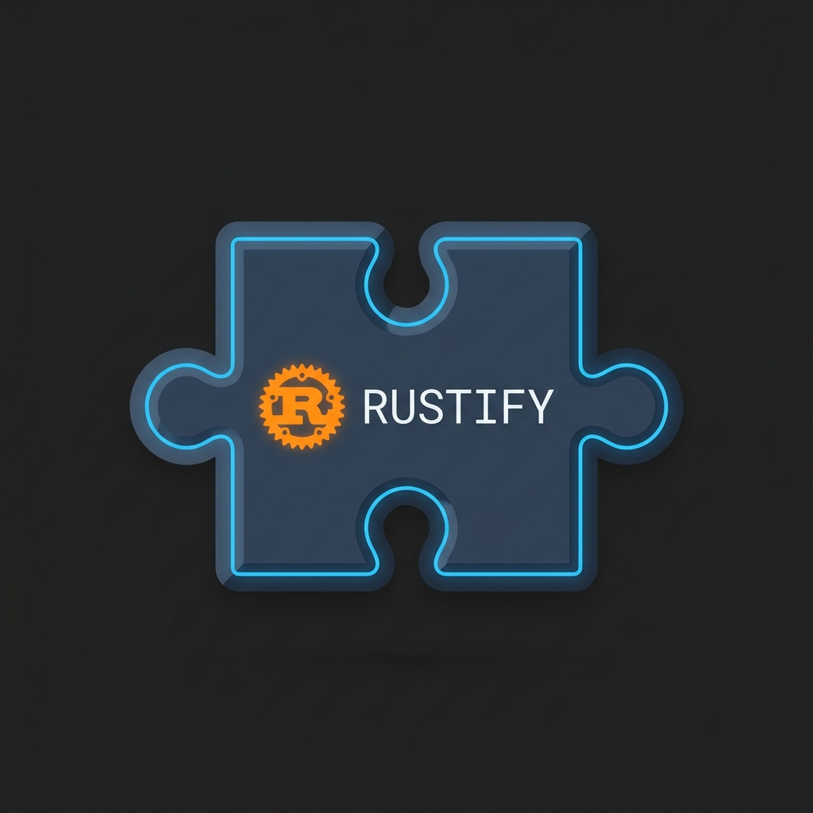

<div align="center">
  
  <h1>Rustify</h1>
  <p><b>Compilador de TypeScript estricto a Rust seguro, legible y libre de advertencias</b></p>

  <p>
    <a href="https://www.rust-lang.org/" target="_blank" rel="noopener noreferrer">
      
    </a>
    <a href="https://www.typescriptlang.org/" target="_blank" rel="noopener noreferrer">
      
    </a>
    <a href="https://oxc.rs/" target="_blank" rel="noopener noreferrer">
      
    </a>
    <a href="https://eslint.org/" target="_blank" rel="noopener noreferrer">
      
    </a>
    <a href="https://nodejs.org/" target="_blank" rel="noopener noreferrer">
      
    </a>
    <a href="https://code.visualstudio.com/" target="_blank" rel="noopener noreferrer">
      
    </a>
    <a href="https://opensource.org/license/mit" target="_blank" rel="noopener noreferrer">
      
    </a>
  </p>
</div>

---

**Rustify** compila un subconjunto deliberadamente estricto de TypeScript a Rust seguro, legible y compatible con proyectos Cargo.

La versión actual `1.0.0` incluye un analizador sintáctico respaldado por Oxc, un analizador compartido, una representación intermedia (IR) tipada, un generador de código de Rust, una interfaz de línea de comandos (CLI), un servidor de lenguaje (LSP), un plugin de ESLint y una extensión de VS Code.

---

## Soportado en 1.0

- Alias de tipos de objetos e interfaces simples a structs de Rust
- Literales de objetos tipados, structs anidados y campos opcionales omitidos
- Acceso reutilizable a campos que no son `Copy` mediante clones explícitos de Rust
- Enlaces reutilizables que no son `Copy` entre llamadas y asignaciones
- Literales de arreglos vacíos y poblados tipados
- Acceso a propiedades de structs anidados y `array.length`
- Lecturas seguras de `array[index]`, métodos nativos `array.includes`/`join`, `array.push`/`pop` locales mutables y métodos de cadenas (strings)
- Enums simples
- Funciones tipadas
- Instrucción `return;` explícita y vacía en funciones `void`
- `string`, `number`, `boolean`, `void`, arreglos, campos opcionales y uniones que admiten nulos (nullable)
- Variables, asignaciones, llamadas a funciones, acceso a propiedades y plantillas de cadena
- Mutabilidad de enlaces comprobada: `const` y parámetros no se pueden reasignar; `let` sí
- Aritmética, residuo (módulo), comparaciones, concatenación de cadenas y lógica booleana
- Expresiones condicionales tipadas (`condicion ? valor : alternativa`)
- Ayudantes numéricos nativos de Math: `abs`, `floor`, `ceil`, `round`, `min`, `max` y `pow`
- Flujo de control tipado `if`/`else`, `while` y `for...of` con `break` y `continue`
- Validación exhaustiva de retorno para cada ruta de funciones no `void`
- Importaciones relativas con nombre y alias, reexportaciones con nombre transitivas y declaraciones exportadas a través de módulos `.ts` aislados
- Exportaciones por defecto con nombre de funciones/tipos e importaciones por defecto
- Emisión de módulos de Rust con importaciones explícitas, aislamiento de declaraciones privadas e identificadores de módulo generados de forma segura
- Rechazo explícito de grafos de módulos nativos cíclicos
- Variantes de enums, valores nulos (`Some`/`None`) y funciones `void`
- Valores seguros `Result<T, E>` y parseo/conversión a cadena de JSON a través de `rustify-runtime`
- Funciones `async` nativas, `await` y transformación de `Promise<T>` a futures de Rust
- Transformación de `console.log(...valores)` tipados con múltiples argumentos a un solo `println!` de Rust
- Generación de identificadores de Rust idiomáticos a partir del camelCase de TypeScript
- Generación en UpperCamelCase de Rust para identificadores de tipos y variantes de enums
- Diagnósticos tempranos para nombres que colisionan tras la normalización de identificadores de Rust
- Diagnósticos compartidos para TypeScript dinámico no soportado

Las características dinámicas de TypeScript como `any`, `unknown`, `eval`, decoradores, espacios de nombres (namespaces), mutación de prototipos y uniones no nulas son rechazadas.

`array.push(value)` se soporta únicamente como una declaración independiente sobre un arreglo local declarado con `let`; el uso de su valor de retorno de longitud en JavaScript es rechazado.
`array.pop()` retorna `T | null`, representado como `Option<T>` en Rust.
`array[index]` también retorna `T | null`; los índices negativos, fraccionarios o fuera de límites producen `null` en lugar de causar pánico (panic).
Los valores que admiten nulos (nullable) soportan operaciones seguras como `isSome()`, `isNone()` y `unwrapOr(fallback)`. Rustify deliberadamente no expone una función `unwrap()` que cause pánico.

Las APIs seguras de JSON retornan un `Result` en lugar de lanzar excepciones:

```ts
function parseDocument(input: string): Result<JsonValue, string> {
  return JSON.parse(input)
}
```

Los valores `Result` soportan operaciones seguras como `isOk()`, `isErr()` y `unwrapOr(fallback)`. Las operaciones `unwrap()` y `unwrapErr()` que provocan pánico no están soportadas intencionalmente.

Los proyectos de Cargo que usan JSON incorporan automáticamente la dependencia `rustify-runtime`.

Las funciones asíncronas de Rustify declaran `Promise<T>` y se compilan a `async fn` nativo de Rust:

```ts
async function loadMessage(): Promise<string> {
  return "ready"
}

async function relayMessage(): Promise<string> {
  return await loadMessage()
}
```

`Promise<T>` está soportada como un retorno asíncrono directo o valor de parámetro. Los campos de tipo Promise, los contenedores Promise anidados y los enlaces almacenados que involucran Promise son rechazados debido a que Rust no puede representarlos con los tipos `impl Future` generados.
Las promesas utilizadas como declaraciones independientes deben ser esperadas con `await` porque los futures de Rust son perezosos (lazy) y, de lo contrario, nunca se ejecutarían. Los valores `Option` y `Result` ignorados se descartan explícitamente en el código de Rust generado para mantener libres de advertencias (warnings) las declaraciones de expresiones intencionales de TypeScript.
Los parámetros directos de tipo Promise deben consumirse exactamente una vez porque los futures generados en Rust son de tipo move-only (solo transferencia). Los parámetros ordinarios no utilizados son declarados explícitamente en el Rust generado para que las funciones válidas de Rustify permanezcan libres de advertencias.

Los enlaces `let` locales solo se convierten en enlaces `mut` de Rust cuando el código posterior realmente los muta. Las variables locales no utilizadas y los enlaces de bucles `for...of` también se declaran explícitamente, manteniendo los proyectos generados compatibles con la directiva `-D warnings`. El análisis de uso y mutación respeta el sombreado léxico (lexical shadowing) entre parámetros, variables locales, ramas y enlaces de bucles. Las declaraciones posteriores al flujo de control terminal se omiten del código Rust generado para que el código TypeScript inalcanzable no introduzca advertencias en Rust ni afecte el análisis de mutabilidad.

El entorno de ejecución asíncrono proporciona temporizadores no bloqueantes:

```ts
async function pause(milliseconds: number): Promise<void> {
  await Rustify.sleep(milliseconds)
}
```

## Modo Híbrido

El modo híbrido (`--mode hybrid`) permite la compilación nativa en Rust combinada con una ejecución alternativa (fallback) dinámica de Node.js a nivel de función:
1. **Anotación a nivel de función**: Marca funciones específicas con un comentario JSDoc `/** @hybrid */`.
2. **Evasión de comprobación de tipos**: Dentro de las funciones híbridas se permiten tipos dinámicos como `any` y no detendrán la compilación nativa.
3. **Transformación a fallback IPC**: El cuerpo de una función híbrida se reemplaza en el código Rust generado por una llamada síncrona de IPC/JSON (`rustify_runtime::call_js_fallback`).
4. **Copiado de código fuente**: El código fuente original de TypeScript se copia automáticamente al directorio `fallback/` en tu salida de compilación para ser cargado dinámicamente por Node.js usando `--experimental-transform-types` en tiempo de ejecución.

```json
{
  "entry": "src/main.ts",
  "out": "dist",
  "cargo": true,
  "package_name": "hybrid-app",
  "mode": "hybrid"
}
```

El modo nativo sigue siendo el predeterminado y continúa rechazando el TypeScript dinámico no soportado a menos que esté explícitamente anotado con `/** @hybrid */`.

## Comandos

```bash
cargo run -p rustify-cli -- check examples/greet.ts
cargo run -p rustify-cli -- explain examples/greet.ts
cargo run -p rustify-cli -- explain examples/greet.ts --json
cargo run -p rustify-cli -- compile examples/greet.ts --out dist-rust
cargo run -p rustify-cli -- compile examples/greet.ts --out dist-rust --cargo
cargo run -p rustify-cli -- init my-rustify-project
```

Dentro de un proyecto inicializado, los comandos resuelven `rustify.json` automáticamente:

```bash
rustify check
rustify compile
rustify compile --no-cargo
rustify explain
rustify --config path/to/rustify.json compile --out custom-output
```

`rustify explain` imprime la firma de Rust inferida, las decisiones de transformación a nivel de instrucción, los mapeos de colecciones seguros, el entorno de ejecución y el código fuente de Rust generado. Usa `--json` para inspeccionar la representación intermedia (IR) tipada completa.

Configuración del proyecto:

```json
{
  "entry": "src/main.ts",
  "out": "dist-rust",
  "cargo": true,
  "package_name": "rustify-output"
}
```

## Ecosistema y Herramientas

Rustify cuenta con un ecosistema de desarrollo completo que consta de varias herramientas especializadas. Explora la documentación detallada de cada componente a continuación:

| Herramienta | Icono | Descripción | Guía |
| :--- | :---: | :--- | :--- |
| **CLI y Compilador** |  | Transpila TypeScript a Rust seguro y libre de advertencias. | [Guía de CLI](docs/cli.md) |
| **Servidor de Lenguaje (LSP)** |  | Diagnósticos en tiempo real, tooltips equivalentes a Rust y navegación semántica. | [Guía de LSP](docs/lsp.md) |
| **Plugin de ESLint** |  | Comprobaciones estáticas de compatibilidad integradas directamente en las herramientas de Node.js. | [Guía de ESLint](docs/eslint.md) |
| **Extensión de VS Code** |  | Integración nativa con el editor con paneles de previsualización de traducción en tiempo real. | [Guía de VS Code](docs/vscode.md) |
| **Playground Interactivo** |  | Sandbox de editor web para experimentar directamente con la compilación. | [Guía del Playground](docs/playground.md) |
| **Patrón de Globales** |  | Patrón de diseño para gestionar constantes y variables globales de forma nativa. | [Guía de Globales](docs/globals.md) |

Para obtener más detalles sobre el funcionamiento interno del compilador y cómo aprovechar el puente IPC híbrido, consulta la [Guía de Arquitectura](docs/architecture.md), la [Guía del Puente de Interoperabilidad Híbrido](docs/hybrid.md) y la [Guía de Globales](docs/globals.md).

## Arquitectura

```text
Oxc TypeScript parser -> AST normalizado -> analizador compartido -> IR tipada -> generación de código de Rust
                                                |
                                                +-> CLI / LSP / herramientas de editor
```

Este repositorio implementa los hitos del compilador y las herramientas nativas mediante soporte asíncrono básico, un puente síncrono híbrido de fallback y un playground de navegador con pipeline compartido. V8 embebido y la cobertura completa de TypeScript siguen siendo elementos del roadmap futuro.

## Desarrollo

```bash
cargo fmt --all --check
cargo test --workspace
./scripts/ci.sh
```

GitHub Actions ejecuta las pruebas del workspace de Rust y los paquetes del editor en Linux, macOS y Windows. El control de integración de Linux compila adicionalmente cada ejemplo soportado como un proyecto Cargo aislado, verifica el ejemplo intencionalmente inválido y ejecuta el fallback híbrido V8 externo junto con la API del playground.
