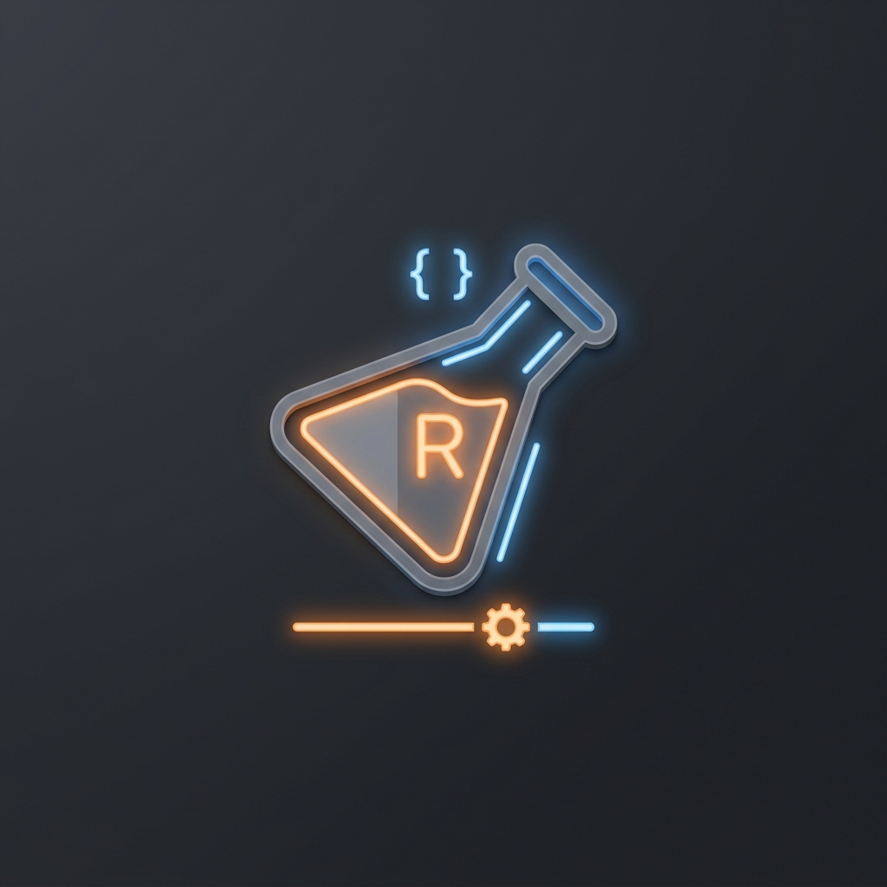

# Playground Interactivo (`rustify-playground`) — Rustify

<p align="center">
  
</p>

El módulo `rustify-playground` provee un portal web interactivo local. Con él, los desarrolladores pueden experimentar con el compilador de Rustify directamente desde el navegador web sin tener que configurar herramientas ni configurar la CLI.

---

## Cómo Iniciar el Playground

El servidor del Playground se incluye en el espacio de trabajo. Para levantarlo localmente:

1. Ejecuta el comando en tu terminal:
   ```bash
   cargo run -p rustify-playground
   ```
2. Una vez que se inicie el servidor web, abre tu navegador favorito y accede a la dirección:
   ```bash
   http://127.0.0.1:3000
   ```

---

## Características

* **Editor en Tiempo Real**: Escribe código TypeScript en el panel izquierdo y observa instantáneamente la traducción a Rust nativo en el panel derecho.
* **Diagnósticos Visuales**: Muestra los errores sintácticos y las violaciones semánticas directamente sobre las líneas del código en el editor web (mediante subrayados de colores informativos).
* **Compilación de la Suite**: Utiliza exactamente el mismo pipeline del compilador principal (`rustify-parser`, `rustify-analyzer`, `rustify-ir` y `rustify-codegen-rust`) asegurando que los resultados coincidan al 100% con la CLI y el LSP.
* **Inspección del AST y el IR**: Te permite alternar vistas para analizar la Representación Intermedia (IR) tipada en formato estructurado de árbol para fines educativos o de depuración avanzada del compilador.
